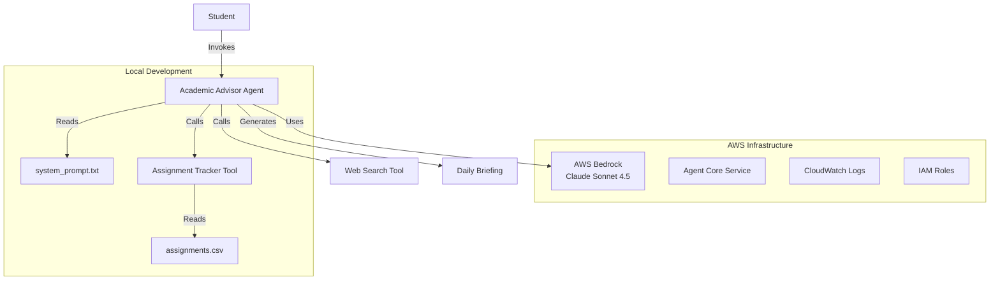
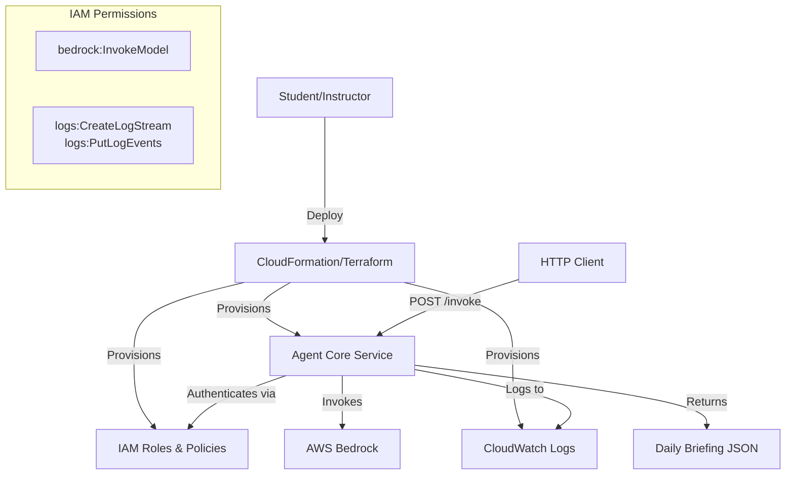

# Design Document: Strands Workshop Program

## Overview

The Strands Workshop Program is an educational system that teaches students to build AI agents using the Strands SDK and AWS Bedrock. The workshop follows a two-stage progression:

1. **Stage One**: Students create a basic Academic Advisor Agent using pre-built tools (web_search)
2. **Stage Two**: Students extend the agent with a custom Assignment Tracker Tool that parses CSV files and generates prioritized daily briefings

The system architecture consists of:
- **Student Development Environment**: Local Python 3.12+ environment with virtual environment and dependencies
- **Academic Advisor Agent**: Python agent using Strands SDK that orchestrates tools and generates structured briefings
- **Assignment Tracker Tool**: Custom tool that reads CSV files, categorizes assignments by deadline, calculates priority scores, and formats output
- **AWS Bedrock Integration**: Claude Sonnet 4.5 model for natural language understanding and briefing generation
- **Agent Core Service**: AWS infrastructure for hosting and executing deployed agents
- **Workshop Materials**: Guide documentation, example data, and reference implementations

The core workflow is: Student provides assignment CSV → Agent invokes Assignment Tracker Tool → Tool parses and prioritizes assignments → Agent uses LLM to generate Daily Briefing with five sections (SITUATION, TODAY, THIS WEEK, HEADS UP, TIP).

## Architecture

### System Components



### Data Flow

1. **Initialization**: Agent loads system prompt from `system_prompt.txt` and configures AWS Bedrock model
2. **Invocation**: Student invokes agent with request: "Give me my daily briefing. My assignments file is 'assignments.csv'."
3. **Tool Execution**: Agent calls `load_assignments(filepath="assignments.csv")`
4. **CSV Processing**: Assignment Tracker Tool:
   - Opens and parses CSV file
   - Filters out completed assignments
   - Categorizes remaining assignments into buckets based on due dates
   - Calculates priority scores within each bucket
   - Formats assignments as structured text
5. **LLM Generation**: Agent sends formatted assignment data + system prompt to Bedrock
6. **Briefing Output**: Bedrock generates Daily Briefing following the five-section structure
7. **Optional Web Search**: If generating study tips, agent may invoke web_search tool

### AWS Infrastructure Architecture



**Infrastructure Components**:
- **Agent Core Service**: Container or Lambda function hosting the agent code
- **IAM Role**: Grants Agent Core Service permissions to invoke Bedrock and write CloudWatch logs
- **CloudWatch Log Group**: Captures agent execution logs, errors, and performance metrics
- **Bedrock Access**: Configured for `us.anthropic.claude-sonnet-4-5` model in specified region

## Components and Interfaces

### Academic Advisor Agent

**Purpose**: Orchestrates tools and LLM to generate personalized daily briefings

**Implementation**:
```python
from strands import Agent
from strands.models import BedrockModel
from strands_tools import web_search

agent = Agent(
    model=BedrockModel(model_id="us.anthropic.claude-sonnet-4-5"),
    system_prompt=load_system_prompt("system_prompt.txt"),
    tools=[load_assignments, web_search]
)
```

**Interface**:
- **Input**: Natural language request (string) containing filepath reference
- **Output**: Formatted Daily Briefing (string) with five sections
- **Dependencies**: 
  - `system_prompt.txt` file must exist
  - AWS credentials must be configured in environment
  - Assignment CSV file must be accessible

**Behavior**:
- Parses user request to extract filepath
- Invokes `load_assignments` tool with filepath
- Sends assignment data + system prompt to Bedrock
- Optionally invokes `web_search` for study tips
- Returns structured briefing text

### Assignment Tracker Tool

**Purpose**: Parse CSV files, categorize assignments, calculate priorities, and format output

**Signature**:
```python
@tool
def load_assignments(filepath: str) -> str:
    """
    Reads assignment CSV, categorizes by deadline, and returns formatted text.
    
    Args:
        filepath: Path to CSV file with columns: course, assignment, due_date,
                  type, estimated_hours, status, notes
    
    Returns:
        Formatted string with categorized assignments and metadata
    
    Raises:
        FileNotFoundError: If filepath does not exist
        ValueError: If CSV is malformed or missing required columns
        ValueError: If due_date format is invalid
    """
```

**Algorithm**:
1. **Initialize**: Get current date and calculate week end date (Sunday)
2. **Parse CSV**: Read file using csv.DictReader
3. **Filter**: Skip rows where status == "complete"
4. **Categorize**: For each assignment:
   - Parse due_date (YYYY-MM-DD format)
   - Compare to today and week_end
   - Place in appropriate bucket: overdue, due_today, due_this_week, upcoming
5. **Sort**: Within each bucket, sort by priority score (implicit via insertion order or explicit sort)
6. **Format**: Generate output string with:
   - Header: current date and week end date
   - Each bucket: title, count, assignment list
   - Each assignment: `[course] assignment — due formatted_date (type, ~hours, status)`
   - Notes: indented below assignment if present
7. **Return**: Formatted string

**Priority Score Calculation**:
```python
priority_score = (days_until_due_weight * days_remaining) + (effort_weight * estimated_hours)
# Default weights: days_until_due_weight = 2.0, effort_weight = 1.0
# Lower score = higher priority (more urgent)
```

**Error Handling**:
- **File not found**: Return `"Assignment file not found: {filepath}"`
- **Missing columns**: Return `"Missing required columns: {column_list}"`
- **Invalid date format**: Return `"Invalid date format in row {row_number}: {due_date_value}. Expected YYYY-MM-DD"`
- **Invalid estimated_hours**: Treat as unknown, display "?" in output

### Web Search Tool

**Purpose**: Provide current study tips and subject-specific advice

**Source**: Pre-built tool from `strands-agents-tools` package

**Usage**: Agent invokes when generating TIP section if subject-specific advice would be helpful

**Fallback**: If web_search fails or is unavailable, agent generates TIP without web search

### System Prompt Configuration

**Purpose**: Define agent personality, output structure, and behavior guidelines

**Location**: `system_prompt.txt` file in project root

**Structure**:
```
Role definition: "You are a sharp academic advisor..."
Output format: Five sections with specific requirements
Style guidelines: "Keep it tight. Direct. No filler."
Tool usage hints: "Use web_search if a subject-specific tip would genuinely help."
```

**Customization**: Students can modify the prompt in Stage Two to experiment with different briefing styles (formal vs. casual, detailed vs. concise, etc.)

## Data Models

### Assignment CSV Schema

**File Format**: CSV with header row

**Required Columns**:
- `course` (string): Course code or name (e.g., "CSCE 350", "ENGL 101")
- `assignment` (string): Assignment name or description
- `due_date` (string): Date in YYYY-MM-DD format (e.g., "2025-01-20")
- `type` (string): Assignment type (e.g., "homework", "exam", "project", "essay")
- `estimated_hours` (string): Estimated completion time in hours (e.g., "3", "1.5")
- `status` (string): Current status (e.g., "not started", "in progress", "complete")
- `notes` (string): Optional notes or reminders (can be empty)

**Example**:
```csv
course,assignment,due_date,type,estimated_hours,status,notes
CSCE 350,HW3 - Graph Algorithms,2025-01-22,homework,3,not started,Focus on Dijkstra's
ENGL 101,Essay Draft,2025-01-20,essay,2,in progress,
MATH 251,Exam 2 Review,2025-01-19,exam,4,not started,Chapters 5-7
CSCE 350,Project Milestone 1,2025-01-15,project,5,complete,
```

**Validation Rules**:
- All columns must be present (empty values allowed for notes)
- `due_date` must parse as valid YYYY-MM-DD date
- `estimated_hours` should be numeric (non-numeric treated as "?")
- `status` is case-insensitive for "complete" check

### Daily Briefing Output Format

**Structure**: Five sections with specific formatting

**Section 1: SITUATION**
- Format: `SITUATION — {one sentence summary}`
- Content: Overall workload intensity assessment
- Example: `SITUATION — Heavy week with 3 assignments due and an exam Thursday`

**Section 2: TODAY**
- Format: `TODAY — {bullet list}`
- Content: Tasks due today in priority order
- Example:
  ```
  TODAY —
  • [MATH 251] Exam 2 Review — due today (exam, ~4h, not started)
  • [ENGL 101] Essay Draft — due today (essay, ~2h, in progress)
  ```

**Section 3: THIS WEEK**
- Format: `THIS WEEK — {day-by-day time blocks}`
- Content: Monday through Sunday schedule with time allocations
- Example:
  ```
  THIS WEEK —
  Monday: 2h ENGL 101 essay draft
  Tuesday: 3h CSCE 350 HW3
  Wednesday: 2h MATH 251 exam review
  Thursday: 4h MATH 251 exam (exam day)
  Friday: 1h CSCE 350 project planning
  Saturday: (catch-up buffer)
  Sunday: (rest)
  ```

**Section 4: HEADS UP**
- Format: `HEADS UP — {upcoming items}`
- Content: Assignments due next week that should be started now
- Example: `HEADS UP — CSCE 350 Project Milestone 2 due next Tuesday, start architecture design this weekend`

**Section 5: TIP**
- Format: `TIP — {actionable advice}`
- Content: One concrete study tip relevant to current workload
- Example: `TIP — For graph algorithms, draw out examples by hand before coding. Visualizing helps catch edge cases.`

### Priority Score Model

**Purpose**: Rank assignments within each bucket to determine order

**Formula**:
```
priority_score = (days_until_due_weight × days_remaining) + (effort_weight × estimated_hours)
```

**Default Weights**:
- `days_until_due_weight = 2.0` (emphasizes urgency)
- `effort_weight = 1.0` (considers workload)

**Interpretation**:
- Lower score = higher priority (appears first in list)
- Assignments with fewer days remaining get lower scores (higher priority)
- Assignments with more estimated hours get higher scores (but less impact than urgency)

**Example Calculation**:
- Assignment A: due in 2 days, 3 hours → score = (2.0 × 2) + (1.0 × 3) = 7.0
- Assignment B: due in 3 days, 1 hour → score = (2.0 × 3) + (1.0 × 1) = 7.0
- Assignment C: due in 1 day, 4 hours → score = (2.0 × 1) + (1.0 × 4) = 6.0 (highest priority)

### Time Block Allocation Algorithm

**Purpose**: Distribute estimated hours across days of the week

**Input**: List of assignments in `due_today` and `due_this_week` buckets with estimated_hours

**Output**: Day-by-day schedule from Monday to Sunday

**Algorithm**:
1. **Collect tasks**: Gather all assignments due today or this week
2. **Sort by due date**: Earliest deadlines first
3. **Allocate backwards**: For each assignment, allocate hours to days before due date
4. **Balance load**: Avoid overloading single days (aim for 4-6 hours per day max)
5. **Buffer days**: Leave weekend days lighter for catch-up and rest

**Example Logic**:
```python
def allocate_time_blocks(assignments):
    schedule = {day: [] for day in ["Monday", "Tuesday", "Wednesday", 
                                     "Thursday", "Friday", "Saturday", "Sunday"]}
    
    for assignment in sorted(assignments, key=lambda a: a.due_date):
        hours_needed = assignment.estimated_hours
        days_until_due = (assignment.due_date - today).days
        
        # Distribute hours across available days before deadline
        days_to_allocate = max(1, days_until_due)
        hours_per_day = hours_needed / days_to_allocate
        
        # Assign to specific days
        for day in get_days_before(assignment.due_date, days_to_allocate):
            schedule[day].append(f"{hours_per_day}h {assignment.course} {assignment.name}")
    
    return schedule
```

**Note**: The actual implementation in the agent relies on the LLM to generate the time block plan based on the formatted assignment data, rather than explicit algorithmic allocation. The LLM uses the estimated_hours field and due dates to create a reasonable schedule.


## Correctness Properties

*A property is a characteristic or behavior that should hold true across all valid executions of a system—essentially, a formal statement about what the system should do. Properties serve as the bridge between human-readable specifications and machine-verifiable correctness guarantees.*

Before writing the correctness properties, I need to analyze which acceptance criteria are suitable for property-based testing versus other testing approaches.


### Property 1: Assignment Bucket Categorization by Date

*For any* assignment with a due_date and status ≠ "complete", the assignment SHALL be placed in exactly one bucket according to these rules:
- If due_date < today → overdue bucket
- If due_date = today → due_today bucket  
- If today < due_date ≤ week_end → due_this_week bucket
- If due_date > week_end → upcoming bucket

**Validates: Requirements 5.1, 5.2, 5.3, 5.4, 5.5**

### Property 2: Complete Assignment Exclusion

*For any* assignment where status = "complete" (case-insensitive), the assignment SHALL NOT appear in any bucket (overdue, due_today, due_this_week, or upcoming).

**Validates: Requirements 4.4**

### Property 3: Priority Score Ordering Within Buckets

*For any* two assignments A and B in the same bucket, if Priority_Score(A) < Priority_Score(B), then A SHALL appear before B in the formatted output, where Priority_Score = (days_until_due_weight × days_remaining) + (effort_weight × estimated_hours).

**Validates: Requirements 5.6**

### Property 4: CSV Column Validation

*For any* CSV file missing one or more required columns (course, assignment, due_date, type, estimated_hours, status, notes), the Assignment_Tracker_Tool SHALL return an error message listing the specific missing column names.

**Validates: Requirements 4.1, 11.3**

### Property 5: Date Parsing Round Trip

*For any* valid date string in YYYY-MM-DD format, parsing the date and then formatting it for output SHALL preserve the date value (though format may change to "Day Mon DD").

**Validates: Requirements 4.2**

### Property 6: Invalid Date Error Reporting

*For any* CSV row containing a due_date that cannot be parsed as YYYY-MM-DD format, the Assignment_Tracker_Tool SHALL return an error message containing the row number, the invalid date value, and the expected format.

**Validates: Requirements 4.3, 11.4**

### Property 7: Empty Notes Field Handling

*For any* assignment with an empty, missing, or whitespace-only notes field, the Assignment_Tracker_Tool SHALL process the assignment without errors and omit the notes line from the output.

**Validates: Requirements 4.5**

### Property 8: File Not Found Error Format

*For any* non-existent filepath, the Assignment_Tracker_Tool SHALL return an error message containing both "not found" and the filepath value.

**Validates: Requirements 7.4, 11.2**

### Property 9: Invalid Estimated Hours Handling

*For any* assignment with a non-numeric estimated_hours value, the Assignment_Tracker_Tool SHALL display "?" in place of the hours value in the formatted output without throwing an error.

**Validates: Requirements 11.5**

### Property 10: Assignment Format Consistency

*For any* assignment in the output, the formatted string SHALL match the pattern: `[{course}] {assignment} — due {formatted_date} ({type}, ~{hours}h, {status})` where formatted_date follows "Day Mon DD" format.

**Validates: Requirements 13.1, 13.2**

### Property 11: Notes Display Format

*For any* assignment with a non-empty notes field, the formatted output SHALL include an indented line below the assignment matching the pattern: `    Note: {notes}`.

**Validates: Requirements 13.3**

### Property 12: Bucket Count Accuracy

*For any* bucket (overdue, due_today, due_this_week, upcoming), the displayed count SHALL equal the actual number of assignments in that bucket, and if the count is zero, the bucket SHALL display "(none)" instead of an empty list.

**Validates: Requirements 13.5, 13.6**

### Property 13: Output Header Presence

*For any* valid CSV input, the Assignment_Tracker_Tool output SHALL begin with a header line containing both the current date and the week end date.

**Validates: Requirements 13.4**

### Property 14: Daily Briefing Structure Completeness

*For any* Daily_Briefing output generated by the Academic_Advisor_Agent, the output SHALL contain exactly one instance of each section header: SITUATION, TODAY, THIS WEEK, HEADS UP, and TIP.

**Validates: Requirements 6.1**

### Property 15: Today's Tasks in TODAY Section

*For any* assignment with due_date = today and status ≠ "complete", the assignment information SHALL appear in the TODAY section of the Daily_Briefing.

**Validates: Requirements 6.3**

### Property 16: Week Day Coverage in Time Block Plan

*For any* Daily_Briefing output, the THIS WEEK section SHALL reference all seven days of the week: Monday, Tuesday, Wednesday, Thursday, Friday, Saturday, and Sunday.

**Validates: Requirements 6.4**

### Property 17: Time Allocation Conservation

*For any* set of assignments due today or this week, the sum of hours allocated in the Time_Block_Plan SHALL equal the sum of estimated_hours for those assignments (within reasonable rounding tolerance).

**Validates: Requirements 6.5**

### Property 18: Next Week Assignments in HEADS UP

*For any* assignment with due_date in the next week (week_end < due_date ≤ week_end + 7 days) and status ≠ "complete", the assignment information SHALL appear in the HEADS UP section of the Daily_Briefing.

**Validates: Requirements 6.6**

### Property 19: Malformed CSV Error Reporting

*For any* CSV file that is malformed or has parsing errors, the Assignment_Tracker_Tool SHALL return an error message identifying the specific parsing issue rather than throwing an unhandled exception.

**Validates: Requirements 7.5**

### Property 20: Output Format Structure Consistency

*For any* valid Assignment_CSV input, the Assignment_Tracker_Tool SHALL return a string containing: a header line, four bucket sections (each with a title and count), and assignment entries formatted according to the specified pattern.

**Validates: Requirements 7.3, 12.5, 13.1**

### Property 21: AWS Credential Error Descriptiveness

*For any* invalid or missing AWS credential configuration, the Academic_Advisor_Agent SHALL return an error message that mentions authentication failure and indicates which credentials are needed.

**Validates: Requirements 3.3**


## Error Handling

### AWS Credential Validation

**Error Condition**: Missing or invalid AWS credentials

**Detection**: Check for presence of `AWS_ACCESS_KEY_ID`, `AWS_SECRET_ACCESS_KEY`, and `AWS_DEFAULT_REGION` environment variables before initializing BedrockModel

**Error Message**: `"AWS credentials not configured. Please set AWS_ACCESS_KEY_ID, AWS_SECRET_ACCESS_KEY, and AWS_DEFAULT_REGION"`

**Recovery**: User must configure environment variables and restart agent

**Implementation**:
```python
import os

def validate_aws_credentials():
    required_vars = ["AWS_ACCESS_KEY_ID", "AWS_SECRET_ACCESS_KEY", "AWS_DEFAULT_REGION"]
    missing = [var for var in required_vars if not os.environ.get(var)]
    if missing:
        raise ValueError(f"AWS credentials not configured. Please set {', '.join(missing)}")
```

### CSV File Not Found

**Error Condition**: Filepath parameter points to non-existent file

**Detection**: `FileNotFoundError` when attempting to open CSV file

**Error Message**: `"Assignment file not found: {filepath}"`

**Recovery**: User must provide correct filepath or create the CSV file

**Implementation**:
```python
try:
    with open(filepath, newline="") as f:
        # process file
except FileNotFoundError:
    return f"Assignment file not found: {filepath}"
```

### Missing Required CSV Columns

**Error Condition**: CSV file lacks one or more required columns

**Detection**: Check CSV header row against required columns list

**Error Message**: `"Missing required columns: {column1}, {column2}, ..."`

**Recovery**: User must add missing columns to CSV file

**Implementation**:
```python
required_columns = {"course", "assignment", "due_date", "type", "estimated_hours", "status", "notes"}
reader = csv.DictReader(f)
actual_columns = set(reader.fieldnames or [])
missing = required_columns - actual_columns
if missing:
    return f"Missing required columns: {', '.join(sorted(missing))}"
```

### Invalid Date Format

**Error Condition**: due_date field cannot be parsed as YYYY-MM-DD

**Detection**: `ValueError` when calling `datetime.strptime()`

**Error Message**: `"Invalid date format in row {row_number}: {due_date_value}. Expected YYYY-MM-DD"`

**Recovery**: User must correct date format in CSV file

**Implementation**:
```python
for row_number, row in enumerate(csv.DictReader(f), start=2):  # start=2 accounts for header
    try:
        due = datetime.strptime(row["due_date"].strip(), "%Y-%m-%d").date()
    except ValueError:
        return f"Invalid date format in row {row_number}: {row['due_date']}. Expected YYYY-MM-DD"
```

### Invalid Estimated Hours

**Error Condition**: estimated_hours field is not a valid number

**Detection**: `ValueError` when converting to float

**Error Message**: None (graceful degradation)

**Recovery**: Display "?" in output instead of hours value

**Implementation**:
```python
try:
    hours = float(row.get("estimated_hours", "").strip())
    hours_display = f"{hours}"
except ValueError:
    hours_display = "?"
```

### AWS Bedrock Rate Limiting

**Error Condition**: Too many requests to Bedrock API

**Detection**: Bedrock API returns rate limit error (HTTP 429 or throttling exception)

**Error Message**: `"Rate limit exceeded. Please wait and try again."`

**Recovery**: Implement exponential backoff retry logic

**Implementation**:
```python
import time
from botocore.exceptions import ClientError

def invoke_with_retry(model, prompt, max_retries=3):
    for attempt in range(max_retries):
        try:
            return model.invoke(prompt)
        except ClientError as e:
            if e.response['Error']['Code'] == 'ThrottlingException':
                if attempt < max_retries - 1:
                    wait_time = 2 ** attempt  # exponential backoff
                    time.sleep(wait_time)
                    continue
                else:
                    return "Rate limit exceeded. Please wait and try again."
            raise
```

### Web Search Tool Unavailable

**Error Condition**: web_search tool fails or is unavailable

**Detection**: Exception when invoking web_search

**Error Message**: None (silent fallback)

**Recovery**: Agent generates TIP section without web search results

**Implementation**: Agent should wrap web_search calls in try-except and continue with generic tips if search fails

### System Prompt File Missing

**Error Condition**: system_prompt.txt file not found

**Detection**: `FileNotFoundError` when loading system prompt

**Error Message**: `"System prompt file not found: system_prompt.txt. This file is required for agent operation."`

**Recovery**: User must create system_prompt.txt file with appropriate content

**Implementation**:
```python
def load_system_prompt(filepath):
    try:
        with open(filepath, 'r') as f:
            return f.read()
    except FileNotFoundError:
        raise FileNotFoundError(f"System prompt file not found: {filepath}. This file is required for agent operation.")
```

## Testing Strategy

### Overview

The Strands Workshop Program requires a comprehensive testing approach that combines:
1. **Property-based tests** for core assignment processing logic
2. **Example-based unit tests** for specific scenarios and edge cases
3. **Integration tests** for AWS services and deployment
4. **Documentation validation** for workshop materials

### Property-Based Testing

Property-based testing is appropriate for the Assignment Tracker Tool's core logic because:
- It processes CSV data with a wide input space (various dates, courses, hours, statuses)
- It has clear universal properties (bucket categorization, sorting, formatting)
- The logic is deterministic and testable without external dependencies
- Testing 100+ random inputs reveals edge cases in date handling and parsing

**PBT Library**: Use `hypothesis` for Python property-based testing

**Configuration**: Minimum 100 iterations per property test

**Test Organization**: Each property from the design document should have a corresponding property-based test

**Example Property Test Structure**:
```python
from hypothesis import given, strategies as st
from datetime import date, timedelta
import pytest

@given(
    due_date=st.dates(min_value=date.today() - timedelta(days=30),
                      max_value=date.today() + timedelta(days=60)),
    status=st.sampled_from(["not started", "in progress", "complete"])
)
def test_property_1_assignment_bucket_categorization(due_date, status):
    """
    Feature: strands-workshop-program, Property 1: Assignment Bucket Categorization by Date
    
    For any assignment with a due_date and status ≠ "complete", the assignment 
    SHALL be placed in exactly one bucket according to date rules.
    """
    if status == "complete":
        return  # Skip complete assignments
    
    today = date.today()
    week_end = date.fromordinal(today.toordinal() + (6 - today.weekday()))
    
    # Create test CSV with single assignment
    csv_content = create_test_csv(due_date=due_date, status=status)
    result = load_assignments(csv_content)
    
    # Verify assignment appears in exactly one bucket
    buckets = parse_buckets(result)
    assignment_count = sum(1 for bucket in buckets.values() if assignment_in_bucket(bucket))
    assert assignment_count == 1, "Assignment must appear in exactly one bucket"
    
    # Verify correct bucket based on date
    if due_date < today:
        assert assignment_in_bucket(buckets["overdue"])
    elif due_date == today:
        assert assignment_in_bucket(buckets["due_today"])
    elif due_date <= week_end:
        assert assignment_in_bucket(buckets["due_this_week"])
    else:
        assert assignment_in_bucket(buckets["upcoming"])
```

**Property Test Coverage**:
- Properties 1-13: Assignment Tracker Tool logic (CSV parsing, categorization, formatting)
- Properties 14-18: Daily Briefing structure and content
- Properties 19-21: Error handling and validation

**Generator Strategies**:
- **Dates**: Generate dates relative to today (past, present, future, week boundaries)
- **Courses**: Generate realistic course codes (e.g., "CSCE 350", "MATH 251")
- **Assignment names**: Generate varied strings including special characters
- **Estimated hours**: Generate valid numbers (0.5-10) and invalid strings
- **Status values**: Include "complete", "in progress", "not started", and edge cases
- **Notes**: Generate empty, whitespace, and content-filled strings

### Example-Based Unit Tests

Example-based tests are appropriate for:
- Specific error messages with exact wording (Requirements 11.1)
- Configuration validation (model_id, default weights)
- Documentation presence checks
- Specific scenarios that demonstrate correct behavior

**Test Cases**:
1. **Exact AWS credential error message**: Verify specific wording when credentials missing
2. **Default priority weights**: Verify days_until_due_weight=2.0, effort_weight=1.0
3. **Model configuration**: Verify model_id="us.anthropic.claude-sonnet-4-5"
4. **System prompt loading**: Verify agent loads system_prompt.txt
5. **Web search tool inclusion**: Verify web_search in agent's tools list
6. **Empty bucket display**: Verify "(none)" appears for empty buckets
7. **Example CSV processing**: Verify provided example CSVs produce expected output structure

**Example Unit Test**:
```python
def test_aws_credential_error_message():
    """Verify exact error message when AWS credentials are missing"""
    # Clear AWS environment variables
    for var in ["AWS_ACCESS_KEY_ID", "AWS_SECRET_ACCESS_KEY", "AWS_DEFAULT_REGION"]:
        os.environ.pop(var, None)
    
    # Attempt to create agent
    with pytest.raises(ValueError) as exc_info:
        agent = create_academic_advisor_agent()
    
    # Verify exact error message
    expected = "AWS credentials not configured. Please set AWS_ACCESS_KEY_ID, AWS_SECRET_ACCESS_KEY, and AWS_DEFAULT_REGION"
    assert str(exc_info.value) == expected
```

### Integration Tests

Integration tests are appropriate for:
- AWS Bedrock API interaction
- Agent Core Service deployment
- CloudWatch logging
- End-to-end agent invocation
- Web search tool functionality

**Test Scenarios**:
1. **Bedrock invocation**: Deploy agent and verify it can call Bedrock API
2. **Rate limiting handling**: Simulate rate limit and verify graceful handling
3. **Agent Core Service deployment**: Deploy IaC templates and verify resources created
4. **CloudWatch logs**: Verify agent execution logs appear in CloudWatch
5. **HTTP API invocation**: Call deployed agent via HTTP and verify response
6. **Web search fallback**: Mock web_search failure and verify agent continues
7. **Local vs deployed consistency**: Compare outputs from local and deployed agent

**Integration Test Example**:
```python
@pytest.mark.integration
def test_agent_core_service_deployment():
    """Verify agent can be deployed to Agent Core Service and invoked via API"""
    # Deploy infrastructure using IaC templates
    stack_id = deploy_cloudformation_stack("agent-core-service.yaml")
    
    try:
        # Get API endpoint from stack outputs
        api_endpoint = get_stack_output(stack_id, "ApiEndpoint")
        
        # Invoke agent via HTTP
        response = requests.post(
            f"{api_endpoint}/invoke",
            json={"prompt": "Give me my daily briefing. My assignments file is 'test_assignments.csv'."}
        )
        
        # Verify response structure
        assert response.status_code == 200
        briefing = response.json()["output"]
        assert "SITUATION" in briefing
        assert "TODAY" in briefing
        assert "THIS WEEK" in briefing
        assert "HEADS UP" in briefing
        assert "TIP" in briefing
    finally:
        # Clean up infrastructure
        delete_cloudformation_stack(stack_id)
```

### Documentation Validation

Validate workshop materials completeness:
- **Workshop Guide**: Verify all required sections present (setup, exercises, troubleshooting)
- **Example CSVs**: Verify three example files exist with specified characteristics
- **Solution code**: Verify Stage One and Stage Two solutions exist and run
- **System prompt examples**: Verify formal and casual prompt variants exist
- **IaC templates**: Verify CloudFormation/Terraform files exist and pass linting

**Validation Script Example**:
```python
def test_workshop_materials_completeness():
    """Verify all required workshop materials are present"""
    required_files = [
        "guide.md",
        "examples/current_week_assignments.csv",
        "examples/overdue_assignments.csv",
        "examples/mixed_assignments.csv",
        "solutions/stage_one_agent.py",
        "solutions/stage_two_agent.py",
        "prompts/formal_advisor.txt",
        "prompts/casual_mentor.txt",
        "infrastructure/cloudformation.yaml",
    ]
    
    for filepath in required_files:
        assert os.path.exists(filepath), f"Missing required file: {filepath}"
```

### Test Data

**Example Assignment CSVs**:

1. **current_week_assignments.csv**: All assignments due within current week
2. **overdue_assignments.csv**: Mix of overdue and current assignments
3. **mixed_assignments.csv**: Assignments across all buckets (overdue, today, this week, upcoming)
4. **edge_cases.csv**: Empty notes, non-numeric hours, special characters, boundary dates
5. **invalid_dates.csv**: Various invalid date formats for error testing
6. **missing_columns.csv**: CSV missing required columns for error testing

**Expected Outputs**: For each example CSV, provide expected Daily_Briefing output showing correct structure

### Test Execution

**Local Development**:
```bash
# Run all tests
pytest tests/

# Run only property-based tests
pytest tests/ -m property

# Run only unit tests
pytest tests/ -m unit

# Run only integration tests (requires AWS credentials)
pytest tests/ -m integration

# Run with coverage
pytest tests/ --cov=src --cov-report=html
```

**CI/CD Pipeline**:
1. **Lint**: Run flake8, mypy for code quality
2. **Unit + Property Tests**: Run fast tests on every commit
3. **Integration Tests**: Run on pull requests to main branch
4. **Documentation Validation**: Verify all materials present
5. **IaC Validation**: Run cfn-lint or terraform validate

### Test Tagging Convention

Each property-based test must include a comment tag referencing the design document property:

```python
def test_property_N_description():
    """
    Feature: strands-workshop-program, Property N: [Property Title]
    
    [Property statement from design document]
    """
    # Test implementation
```

This ensures traceability from requirements → design properties → test implementation.

